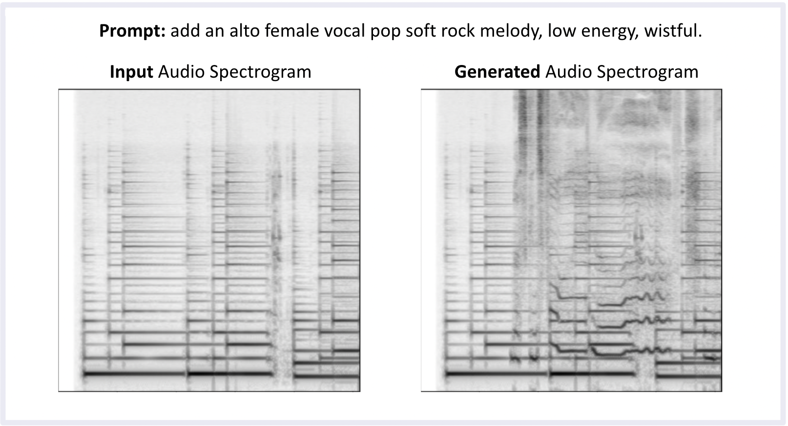
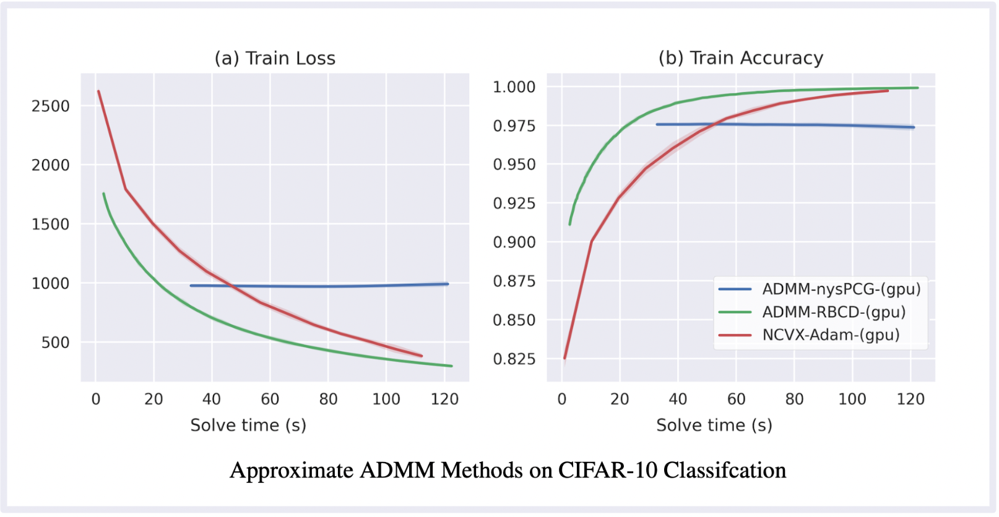
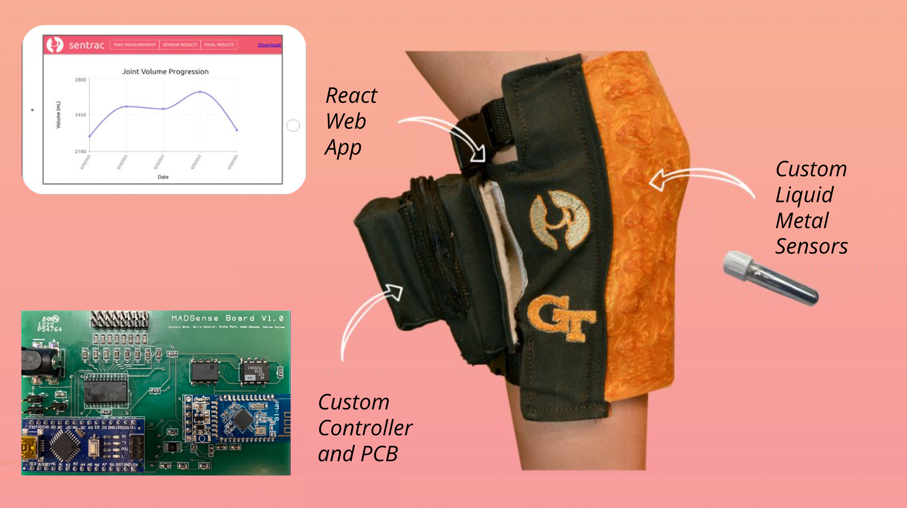
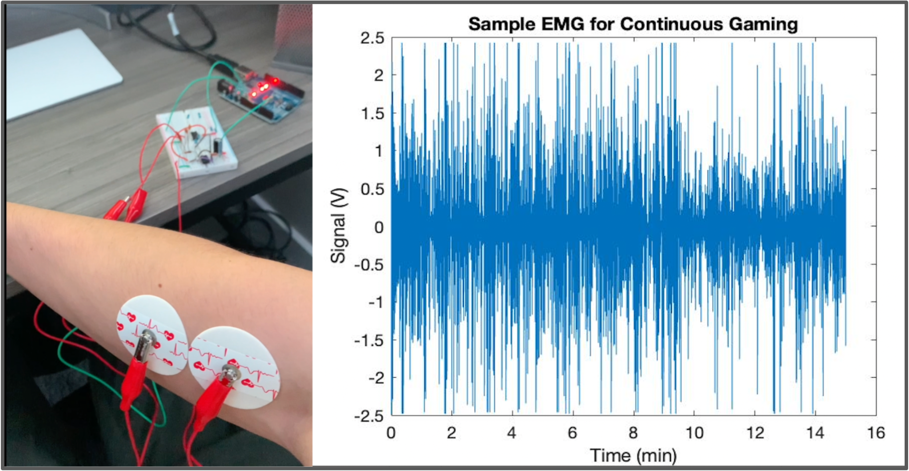

# Data Scientist

**Summary**: Graduate student seeking a full-time data science role beginning summer of 2024.

#### Technical Skills: Python, MATLAB, SQL, AWS

#### Contact: [Email](mailto:zshah9@stanford.edu) | [LinkedIn](https://www.linkedin.com/in/zacharyshah/)

## Education
---
- M.S., Electrical Engineering | Stanford University (_Apr 2024_)	 			        		

- B.S., Biomedical Engineering | Georgia Tech (_May 2022_)

## Work Experience
---
**Data Science Intern @ Medtronic (_Summer 2022 & Summer 2023_)**
- Modeled signal behavior and developed machine learning tools to improve next-generation continuous glucose monitoring platforms
- Developed MATLAB infrastructure for optimizing and assessing innovative algorithm features
- Designed a patent-pending signal de-trending algorithm

**Research Assistant @ Inan Lab, Georgia Tech (_Aug 2021- May 2022_)**
- Conducted patient data collection & processing for a bed-based health monitoring system, collab. with Hillrom
- Developed PyTorch deep learning models (GANs, Gated Attention networks) for ballistiocardiogram heartbeat segmentation
- Explored time series metrics like the Signal Quality Index to differentiate motion artifacts and noise from heartbeat features

<!-- **Business Analytics Intern @ Covidien (Summer 2021)**
- Built analysis leveraging SQL to provide insight to margin enhancement & risk across new product portfolio
- Supported teammates by creating analysis for understanding inventory needs for line transfer strategy for new product launch -->

## Projects
---

### Stable Diffusion for Audio Inpainting
Code ([riff-cnet](https://github.com/zachary-shah/riff-cnet)) ([riff-pix2pix](https://github.com/zachary-shah/riff-pix2pix)) | Paper <a id="raw-url" href="https://raw.githubusercontent.com/zachary-shah/zachary-shah.github.io/master/assets/writing/StableDiffusionAudioInpainting.pdf">(Download)</a>

This project aims to generate new instrumentation into acoustic audio using Stable Diffusion technology. By turning audio into mel-spectrogram images, text prompts can direct a spectrogram image edit to "paint in" a desired change to the audio, such as adding a singer's voice. Using both ControlNet and InstructPix2Pix as methods to control the desired generative changes, this project introduces the idea of musical decomposition learning, or learning the conditional distribution of an instrument given other classes of instruments.

Click to listen to examples of inpainted melodies using [ControlNet](https://github.com/zachary-shah/riff-cnet/tree/main#examples-of-our-models-samples) and [InstructPix2Pix](https://github.com/zachary-shah/riff-pix2pix#results).

### Convex Optimization of 2-layer Neural Networks
Code ([Github](https://github.com/zachary-shah/admmNN)) | Paper <a id="raw-url" href="https://raw.githubusercontent.com/zachary-shah/zachary-shah.github.io/master/assets/writing/ScalableADMMConvexNeuralNetworks.pdf">(Download)</a>

This project reformulates the non-convex training landscape of a ReLU-activated neural network as a convex optimization problem solved via the Alternating Direction Method of Multipliers (ADMM). We examine three practical ADMM based methods for solving this reformulated problem, and examine their performance with GPU acceleration on PyTorch and JAX. The main contribution to this work is exploring stochastic and preconditioned approximations to meliorate the expensive linear systems solve of the ADMM algorithm. This project examines scalability and acceleration of these methods, in order to encourage applications across a wide range of statistical learning settings. 

### Joint Health Monitoring System
Code ([Github](https://github.com/zshah9/sentrac)) | Poster <a id="raw-url" href="https://raw.githubusercontent.com/zachary-shah/zachary-shah.github.io/master/assets/writing/JointHealthMonitor.jpg">(Download)</a>

My undergraduate senior design project, in collaboration with the Army Research Lab. We created a wearable knee sleeve to monitor long-term arthritic joint swelling. After conducting extensive interviews with sports practitioners and rheumatologists, we discovered that clinical professionals lack the capabilities to provide reliable quantified metrics of the progression of arthritis. To address this, we quantified the fluidic swelling of a joint by building a wearable monitor, employing a custom fabricated printed circuit board and strain sensors built from liquid-metal alloys embedded into a silicone mesh. To gauge joint swelling, I designed a calibration model to map strain-induced voltages from these sensors to geometric measures across the knee. To demonstrate the patient use-case, I developed a web app using React to display real-time joint measurements collected via Bluetooth.

### Console Gaming Injury Prediction via EMG
Code ([Github](https://github.com/zachary-shah/emg-rsi-indicator)) | Poster <a id="raw-url" href="https://raw.githubusercontent.com/zachary-shah/zachary-shah.github.io/master/assets/writing/ConsoleGamingEMGforRSI.pdf">(Download)</a>

An undergraduate class research project to indicate strain injury risks during console gaming. I designed a data acquisition system with an Arduino to collect a subject’s electromyogram (EMG), a measure of the electrical activity of muscles, into MATLAB. We examined what regions of the EMG power spectral density could be used as an indicator classify forearm fatigue during extended periods of gaming. 

## Other Accolades
---

### Teaching Assistantships
- Information Science and Engineering, Stanford Univeristy, Spring 2023
- Problems in Biomedical Engineering, Georgia Tech, Fall 2020 & Spring 2021

### Publications
- Yoon, J.-K., Kim, J., Shah, Z., Awasthi, A., Mahajan, A., Kim, Y., Advanced Human BBB-on-a-Chip: A New Platform for Alzheimer's Disease Studies. Adv. Healthcare Mater. 2021, 10, 2002285. https://doi.org/10.1002/adhm.202002285

### Awards
- Dr. Dan Fielder Memorial Award for Excellence in Signal Processing Coursework, May 2021
- American Society for Gravitational and Space Research Poster Competition, 3rd Prize, Aug 2017

